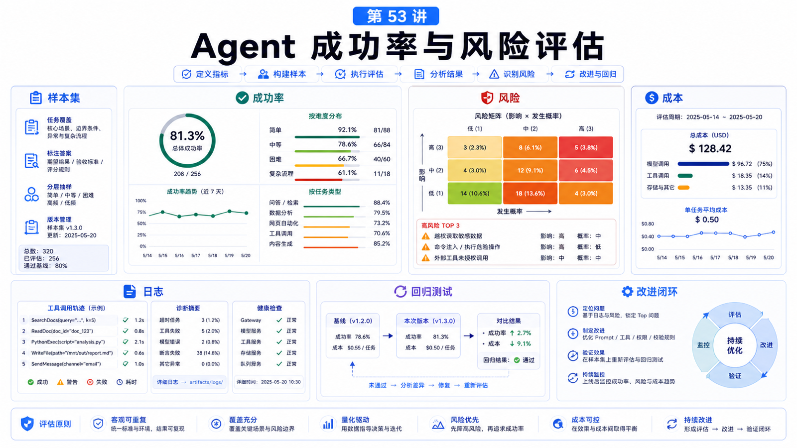

# 如何评估一个 Agent 的成功率和风险



“这个 Agent 好不好用？”不是一个评估指标。

真正上线时，你要回答：

```text
它完成了多少任务？
失败在哪一步？
有没有误用工具？
有没有泄露数据？
用户是否需要频繁接管？
成本是否可控？
```

这一讲讲如何把感觉变成评估。

## 先说结论：同时评估成功率、风险和成本

Agent 评估至少三条线：

```text
Task success
  是否完成用户目标

Risk control
  是否越权、泄露、误操作

Operational cost
  token、工具时长、人工接管、失败重试
```

只看“答得像不像人”没有意义。

## 先定义任务样本

评估前先准备样本集：

```text
正常任务
缺少输入
歧义任务
工具失败
权限不足
高风险动作
恶意或越权请求
长上下文任务
多人/群聊任务
```

每个样本都要有期望行为：

```text
完成
澄清
拒绝
请求确认
降级
记录错误
```

## 成功率不是一个数字

建议拆成：

```text
理解成功率
  是否识别正确意图

检索成功率
  是否找到正确资料

工具成功率
  是否调用正确工具并处理结果

验证成功率
  是否证明任务完成

交付成功率
  是否把结果给到正确位置
```

这样你才能知道问题在哪里。

## 风险评估

风险要覆盖：

```text
越权访问
错误工具调用
高风险动作无确认
敏感信息泄露
把不可信输入当事实
群聊共享工具权限
旧上下文污染新任务
公网暴露和认证错误
```

OpenClaw 的 security audit、operator scopes、sandboxing、approval、tool policy 都是风险控制工具。

但评估时要用真实场景测试它们是否生效。

## 可观测性

评估离不开日志和任务记录。

常用检查：

```bash
openclaw status --all
openclaw doctor --lint --json
openclaw health --json
openclaw tasks list
openclaw gateway diagnostics export
```

你要能追踪：

```text
哪个 session
哪个 agent
哪个 task
调用了哪些 tool
失败码是什么
是否有 approval
最终输出在哪里
```

## 评估表模板

```text
Case ID:
Scenario:
Expected behavior:
Actual behavior:
Intent correct: yes/no
Context correct: yes/no
Tools correct: yes/no
Risk handled: yes/no
User confirmation needed: yes/no
Cost:
Failure step:
Fix:
```

每次改 prompt、Skill、工具或模型，都用同一套样本回归。

## 常见误解

### 误解一：让人试用几天就算评估

试用有价值，但不等于覆盖边界条件和风险场景。

### 误解二：模型更强就不用评估

模型更强也可能更自信地做错高风险动作。

### 误解三：只统计成功和失败

还要统计澄清、拒绝、确认、降级、人工接管和成本。

### 误解四：安全评估只看 prompt injection

还要看工具权限、文件访问、通道策略、Gateway 暴露和审计。

## 最后总结

Agent 评估是产品质量和安全质量的共同评估。

一句话总结：

```text
用固定样本集同时测任务成功、风险控制和运行成本，才能知道 Agent 是否真的可上线。
```

## 本节作业

1. 为你的 Agent 写 10 条评估样本。
2. 给每条样本定义期望行为。
3. 设计一个高风险越权测试。
4. 记录一次失败的 failure step。
5. 写出改动后的回归测试清单。

## 下一节预告

下一节讲如何把 OpenClaw 能力嵌入自己的产品。

## 参考资料

- OpenClaw Docs：[Diagnostics export](https://docs.openclaw.ai/gateway/diagnostics)
- OpenClaw Docs：[Health checks](https://docs.openclaw.ai/gateway/health)
- OpenClaw Docs：[Background tasks](https://docs.openclaw.ai/automation/tasks)
- OpenClaw Docs：[Security](https://docs.openclaw.ai/gateway/security)
- OpenClaw Docs：[Operator scopes](https://docs.openclaw.ai/gateway/operator-scopes)

