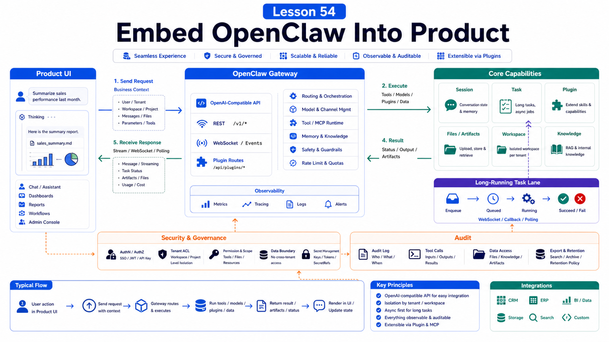

# How to Embed OpenClaw Capability Into Your Product



Embedding OpenClaw is not just adding a chat box.

A product needs to know:

```text
Where does the user trigger the agent?
Which identity does the agent use?
Which data can it access?
How do results return to the product?
How are failures shown?
How do permissions and audit work?
```

This lesson covers the embedding architecture.

## The Key Idea: Treat OpenClaw as an Agent Runtime

OpenClaw can sit behind your product as:

```text
Gateway runtime
tool execution layer
session and task manager
Skill and plugin host
OpenAI-compatible API surface
```

Your product owns UX and business authorization. OpenClaw owns agent execution and tool orchestration.

## Entry Points

Common triggers:

```text
in-product chat
"AI handle this" on a ticket page
"analyze this data" on a report page
"generate draft" in an admin flow
webhook trigger
scheduled job
```

Each entry should pass business context:

```text
tenantId
userId
resourceId
sessionKey
allowed tools
request scope
```

Do not forward only the raw user message.

## Gateway API Shape

The Gateway port carries:

```text
WebSocket control/RPC
HTTP APIs
OpenAI-compatible endpoints
Plugin routes
Control UI
```

OpenAI-compatible endpoints include:

```text
GET /v1/models
POST /v1/embeddings
POST /v1/chat/completions
POST /v1/responses
```

This helps existing AI product frameworks integrate.

But these APIs still live inside the Gateway trust boundary and need authentication and authorization design.

## Product vs OpenClaw Responsibilities

```text
Product owns:
  user login
  tenant permissions
  business resource ACL
  billing and quotas
  UI state
  product audit

OpenClaw owns:
  agent sessions
  tool calls
  Skills / plugins
  Browser / MCP / Shell
  background tasks
  Gateway health
```

Do not delegate business authorization to the model.

## Returning Results

Agent output may be:

```text
text response
draft
file
chart
task status
external system update
operation needing confirmation
```

The UI should show:

```text
running
waiting for user input
waiting for approval
failed with retry
completed with evidence
```

Long tasks should not rely on one long HTTP request. Use background tasks, status polling, or push updates.

## Security Boundaries

When embedding:

```text
do not expose Gateway without auth
do not treat sessionKey as auth
isolate tenant workspaces and credentials
use approvals for high-risk tools
minimize browser and shell permissions
redact logs and diagnostics
```

The OpenClaw security docs state that hostile multi-tenant cases need separate trust boundaries.

## Common Misunderstandings

### OpenAI-compatible API means SaaS API

No. It is a model/agent compatibility surface, not product-level user and tenant auth.

### Giving the agent the whole product DB is convenient

It is risky. Expose minimal tools or MCP capabilities.

### Showing "failed" is enough

The product should show failure stage, retry action, and human handoff.

### Audit can be added later

Audit should be in the first version.

## Final Summary

Embedding is about clear responsibility boundaries.

```text
The product owns users, permissions, and UX; OpenClaw owns agents, tools, and tasks; connect them with explicit context, auth, and audit.
```

## Exercises

1. Choose one product page and design an agent trigger.
2. List business context passed to OpenClaw.
3. Split product vs OpenClaw responsibilities.
4. Design long-task UI states.
5. List audit fields.

## Next Lesson Preview

Next is the final project: a deployable OpenClaw business assistant.

## References

- OpenClaw Docs: [Gateway runbook](https://docs.openclaw.ai/gateway)
- OpenClaw Docs: [Authentication](https://docs.openclaw.ai/gateway/authentication)
- OpenClaw Docs: [Remote Gateway](https://docs.openclaw.ai/gateway/remote)
- OpenClaw Docs: [Building plugins](https://docs.openclaw.ai/plugins/building-plugins)
- OpenClaw Docs: [Tool plugins](https://docs.openclaw.ai/plugins/tool-plugins)
- OpenClaw Docs: [Security](https://docs.openclaw.ai/gateway/security)

