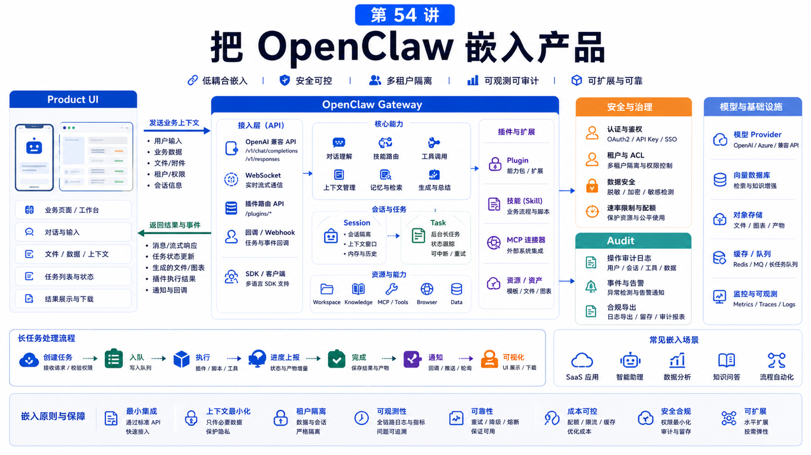

# 如何把 OpenClaw 能力嵌入自己的产品



把 OpenClaw 嵌入产品，不是把聊天框放到网页上。

产品真正需要的是：

```text
用户在哪里触发 Agent？
Agent 用哪个身份工作？
能访问哪些数据？
结果如何回到产品？
失败如何展示？
权限和审计怎么做？
```

这一讲讲嵌入架构。

## 先说结论：把 OpenClaw 当作 Agent Runtime

你可以把 OpenClaw 放在产品后面，作为：

```text
Gateway runtime
tool execution layer
session and task manager
skill and plugin host
OpenAI-compatible API surface
```

产品前端负责用户体验和业务权限，OpenClaw 负责 Agent 执行和工具编排。

## 嵌入入口

常见入口：

```text
产品内聊天框
工单详情页上的“AI 处理”
报表页上的“分析这份数据”
后台操作页上的“生成草稿”
Webhook 触发
定时任务
```

每个入口都要带上业务上下文：

```text
tenantId
userId
resourceId
sessionKey
allowed tools
request scope
```

不要只把用户输入原样转给 Agent。

## Gateway API 形态

OpenClaw Gateway 提供多种能力面。

官方 runbook 提到同一个 Gateway 端口承载：

```text
WebSocket control/RPC
HTTP APIs
OpenAI-compatible endpoints
Plugin routes
Control UI
```

OpenAI-compatible endpoints 包括：

```text
GET /v1/models
POST /v1/embeddings
POST /v1/chat/completions
POST /v1/responses
```

这让已有 AI 产品框架更容易接入。

但要记住：这些 API 仍然处在 Gateway 的信任边界内，需要认证和权限设计。

## 产品和 OpenClaw 的职责分工

```text
产品负责：
  用户登录
  租户权限
  业务资源 ACL
  计费和额度
  UI 状态
  产品级审计

OpenClaw 负责：
  Agent 会话
  工具调用
  Skill / Plugin
  Browser / MCP / Shell
  Background tasks
  Gateway health
```

产品不要把自己已有的授权逻辑丢给模型判断。

## 结果回传

Agent 结果可能是：

```text
文本回复
草稿
文件
图表
任务状态
外部系统更新
需要确认的操作
```

产品 UI 要能表达：

```text
运行中
等待用户输入
等待审批
失败可重试
完成并附证据
```

长任务不要只靠 HTTP request 一直等。用 background task、状态轮询或推送。

## 安全边界

嵌入产品时尤其要注意：

```text
Gateway 不要无认证暴露
不要把 sessionKey 当 auth
每个租户的 workspace 和凭据要隔离
高风险工具需要 approval
浏览器和 shell 工具要最小权限
日志和诊断要脱敏
```

OpenClaw 官方安全文档强调，如果是敌对多租户，需要拆分信任边界。

## 常见误解

### 误解一：OpenAI-compatible API 就等于 SaaS API

不等于。它是模型/Agent 兼容面，不替代产品级用户、租户和权限。

### 误解二：把产品 DB 全给 Agent 最方便

风险太高。应该通过受控工具或 MCP 暴露最小能力。

### 误解三：Agent 失败只显示“失败”就够

产品要展示失败阶段、可重试动作和人工接管入口。

### 误解四：先嵌入再考虑审计

审计必须和第一版一起设计。

## 最后总结

产品嵌入的关键是职责分工。

一句话总结：

```text
产品管用户、权限和体验；OpenClaw 管 Agent、工具和任务；两者之间用明确上下文、认证和审计连接。
```

## 本节作业

1. 选一个产品页面，设计 Agent 触发入口。
2. 写出要传给 Agent 的业务上下文。
3. 定义产品侧和 OpenClaw 侧的职责边界。
4. 设计长任务状态 UI。
5. 列出必须审计的字段。

## 下一节预告

下一节是最终项目：做一个可部署的 OpenClaw 业务助手。

## 参考资料

- OpenClaw Docs：[Gateway runbook](https://docs.openclaw.ai/gateway)
- OpenClaw Docs：[Authentication](https://docs.openclaw.ai/gateway/authentication)
- OpenClaw Docs：[Remote Gateway](https://docs.openclaw.ai/gateway/remote)
- OpenClaw Docs：[Building plugins](https://docs.openclaw.ai/plugins/building-plugins)
- OpenClaw Docs：[Tool plugins](https://docs.openclaw.ai/plugins/tool-plugins)
- OpenClaw Docs：[Security](https://docs.openclaw.ai/gateway/security)

