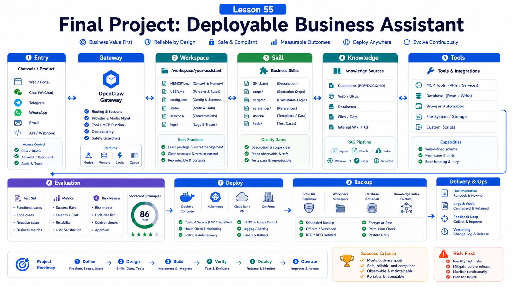

# Final Project: Build a Deployable OpenClaw Business Assistant



After the previous lessons, the goal is not just to understand OpenClaw.

The goal is to ship a real assistant.

It should:

```text
receive business requests
read controlled context
call necessary tools
produce verifiable results
handle failure
leave audit evidence
deploy, update, and back up cleanly
```

This lesson gives you the final project blueprint.

## Project Goal

Build a support ticket assistant.

It can:

```text
connect to Telegram or WhatsApp
receive support questions
search knowledge base
read ticket or order context
draft replies
create internal notes when appropriate
ask for confirmation on high-risk actions
produce a daily summary
```

You may adapt it into:

```text
sales analysis assistant
deployment check assistant
contract review assistant
knowledge-base Q&A assistant
```

The project structure stays the same.

## Architecture Blueprint

```text
Channel / Product UI
  -> Gateway
  -> Agent session
  -> Skill
  -> Tools / MCP / Browser / Memory
  -> Verification
  -> User delivery
  -> Logs / Tasks / Audit
```

Minimum requirements:

```text
one clear entry point
one workspace
one business Skill
one knowledge source
one tool or script
one confirmation point
one evaluation set
one deployment and backup path
```

## Step One: Prepare Deployment

Local or Docker both work.

Local:

```bash
openclaw --version
openclaw doctor
openclaw gateway status
```

Docker:

```bash
./scripts/docker/setup.sh
curl -fsS http://127.0.0.1:18789/readyz
```

Record:

```text
state dir
workspace
gateway port
config path
backup path
provider key management
```

## Step Two: Design the Workspace

Example:

```text
workspace/
  AGENTS.md
  USER.md
  MEMORY.md
  skills/
    support-ticket/
      SKILL.md
      references/
        refund-policy.md
        escalation-rules.md
      scripts/
        validate-ticket.js
  knowledge/
    faq.md
    product-notes.md
  output/
```

Do not put all company data in the workspace.

Keep only the assistant's working context there. Use controlled tools for sensitive data.

## Step Three: Write the Business Skill

`skills/support-ticket/SKILL.md`:

```yaml
---
name: support-ticket
description: Use for customer support ticket triage; searches policy, drafts replies, and never issues refunds without human confirmation.
---
```

Include:

```text
when to use
required inputs
how to search knowledge
how to decide escalation
how to draft replies
forbidden automatic actions
output format
```

## Step Four: Configure Entry and Permissions

Telegram example:

```json5
{
  session: { dmScope: "per-channel-peer" },
  channels: {
    telegram: {
      enabled: true,
      dmPolicy: "allowlist",
      allowFrom: ["tg:123456789"],
      groups: {
        "-1001234567890": { requireMention: true },
      },
    },
  },
}
```

For WhatsApp, design allowlists, group policy, and account isolation.

Start with minimal tools:

```text
allow: memory_search, business query tools, draft generation
restrict: exec, private-network browser, external send, production writes
```

## Step Five: Verify and Evaluate

Prepare at least 10 cases:

```text
normal question
missing order id
policy not found
customer asks for refund
high-value refund
malicious unauthorized request
group message without mention
tool failure
stale knowledge
needs escalation
```

Define expected behavior for each.

Record:

```text
intent correct?
citation found?
refusal or confirmation correct?
draft usable?
sensitive data leaked?
cost and duration?
```

## Step Six: Launch Checklist

Before launch:

```text
openclaw doctor --lint --json passes
openclaw health --json is healthy
channels status --probe is healthy
workspace is backed up
state dir is backed up
provider keys are not scattered in plaintext
high-risk tools require approval
logs and diagnostics are redacted
update and rollback path is documented
```

## Final Deliverables

Ship:

```text
README.md
openclaw.json example
workspace structure
business Skill
sample knowledge base
tool scripts
evaluation table
deployment steps
backup and restore steps
risk notes
```

That is what deployable means.

## Common Misunderstandings

### The final project is just a chat bot

No. It also needs permissions, evaluation, deployment, backup, and recovery.

### Write the Skill after launch

The Skill is core business behavior. Write and test it early.

### Answering questions means success

Also evaluate citations, confirmations, audit, failure recovery, and cost.

### Production is the same as a local demo

Production needs service management, secrets, remote access, health checks, and update plans.

## Final Summary

The final project turns OpenClaw from a tool into part of a business system.

```text
A deployable assistant needs entry, context, Skill, tools, permissions, verification, evaluation, deployment, and recovery.
```

## Exercises

1. Choose a business assistant topic.
2. Draw the flow from entry to tool to delivery.
3. Write the workspace structure.
4. Write a minimal business Skill.
5. Prepare 10 evaluation cases.
6. Write deployment and backup checklists.

## Next Lesson Preview

The course now forms a complete loop. Next, you can extend the final project into a plugin, SaaS product, or internal team workflow standard.

## References

- OpenClaw Docs: [Install](https://docs.openclaw.ai/install)
- OpenClaw Docs: [Docker](https://docs.openclaw.ai/install/docker)
- OpenClaw Docs: [Gateway runbook](https://docs.openclaw.ai/gateway)
- OpenClaw Docs: [Creating skills](https://docs.openclaw.ai/tools/creating-skills)
- OpenClaw Docs: [Memory search](https://docs.openclaw.ai/concepts/memory-search)
- OpenClaw Docs: [Security](https://docs.openclaw.ai/gateway/security)
- OpenClaw Docs: [Updating](https://docs.openclaw.ai/install/updating)

