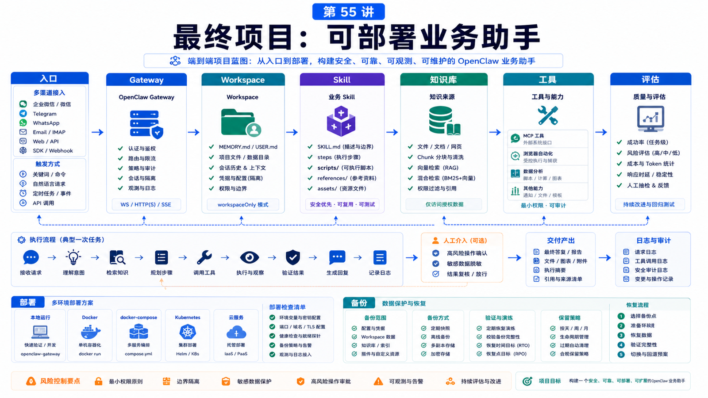

# 最终项目：做一个可部署的 OpenClaw 业务助手



学完前面所有内容，最终要做的不是“懂 OpenClaw”，而是能交付一个真实助手。

这个助手应该能：

```text
接收业务请求
读取受控上下文
调用必要工具
生成可验证结果
处理失败
留下审计线索
能部署、能升级、能备份
```

这一讲给你一个最终项目蓝图。

## 项目目标

做一个“客服工单处理助手”。

它能：

```text
接入 Telegram 或 WhatsApp
接收客服问题
查询知识库
读取工单或订单上下文
生成回复草稿
必要时创建内部备注
高风险动作请求人工确认
输出每日处理摘要
```

你也可以替换成：

```text
销售数据分析助手
部署巡检助手
合同审查助手
知识库问答助手
```

但项目结构保持一致。

## 架构蓝图

```text
Channel / Product UI
  -> Gateway
  -> Agent session
  -> Skill
  -> Tools / MCP / Browser / Memory
  -> Verification
  -> User delivery
  -> Logs / Tasks / Audit
```

最低要求：

```text
一个明确入口
一个 workspace
一个业务 Skill
一个知识来源
一个工具或脚本
一个确认点
一个评估样本集
一套部署和备份方式
```

## 第一步：准备部署

本地或 Docker 都可以。

本地：

```bash
openclaw --version
openclaw doctor
openclaw gateway status
```

Docker：

```bash
./scripts/docker/setup.sh
curl -fsS http://127.0.0.1:18789/readyz
```

无论哪种方式，都要记录：

```text
state dir
workspace
gateway port
config path
backup path
provider keys 管理方式
```

## 第二步：设计 Workspace

示例：

```text
workspace/
  AGENTS.md
  USER.md
  MEMORY.md
  skills/
    support-ticket/
      SKILL.md
      references/
        refund-policy.md
        escalation-rules.md
      scripts/
        validate-ticket.js
  knowledge/
    faq.md
    product-notes.md
  output/
```

Workspace 不要放全公司数据。

只放这个助手需要的上下文，敏感材料用受控工具读取。

## 第三步：写业务 Skill

`skills/support-ticket/SKILL.md`：

```yaml
---
name: support-ticket
description: Use for customer support ticket triage; searches policy, drafts replies, and never issues refunds without human confirmation.
---
```

正文写：

```text
什么时候使用
需要哪些输入
如何查询知识库
如何判断升级
如何生成回复草稿
哪些动作禁止自动执行
输出格式
```

## 第四步：配置入口和权限

如果用 Telegram：

```json5
{
  session: { dmScope: "per-channel-peer" },
  channels: {
    telegram: {
      enabled: true,
      dmPolicy: "allowlist",
      allowFrom: ["tg:123456789"],
      groups: {
        "-1001234567890": { requireMention: true },
      },
    },
  },
}
```

如果用 WhatsApp，也要设计 allowlist、groupPolicy 和多账号隔离。

工具权限从最小开始：

```text
允许：memory_search、业务查询工具、生成草稿
限制：exec、browser 私网、外部发送、生产写入
```

## 第五步：验证和评估

准备至少 10 条样本：

```text
正常咨询
缺少订单号
政策找不到
客户要求退款
高金额退款
恶意越权请求
群聊未 @
工具失败
知识库过期
需要人工升级
```

每条都写期望行为。

执行后记录：

```text
是否理解意图
是否找到引用
是否正确拒绝或确认
是否输出可用草稿
是否泄露敏感信息
成本和耗时
```

## 第六步：上线检查

上线前 checklist：

```text
openclaw doctor --lint --json 通过
openclaw health --json 正常
channels status --probe 正常
workspace 备份
state dir 备份
provider key 不明文乱放
高风险工具有 approval
日志和诊断脱敏
更新和回滚路径明确
```

## 最终交付物

你应该交付：

```text
README.md
openclaw.json 示例
workspace 目录结构
业务 Skill
知识库样例
工具脚本
评估样本表
部署步骤
备份和恢复步骤
风险说明
```

这才是“可部署”的意思。

## 常见误解

### 误解一：最终项目就是做一个聊天 bot

不够。它还要有权限、评估、部署、备份和恢复。

### 误解二：先上线再写 Skill

Skill 是业务行为的核心，应先写再测。

### 误解三：能回答问题就算成功

还要看引用、确认、审计、失败恢复和成本。

### 误解四：生产环境和本地 demo 一样

生产环境要考虑服务管理、密钥、远程访问、健康检查和升级。

## 最后总结

最终项目的目标，是把 OpenClaw 从工具变成业务系统的一部分。

一句话总结：

```text
一个可部署的业务助手，必须同时具备入口、上下文、Skill、工具、权限、验证、评估、部署和恢复。
```

## 本节作业

1. 选择一个业务助手主题。
2. 画出入口到工具再到交付的流程图。
3. 写出 workspace 目录结构。
4. 写一个最小业务 Skill。
5. 准备 10 条评估样本。
6. 写部署和备份清单。

## 下一节预告

这套课程到这里形成闭环。下一步可以把最终项目扩展成插件、SaaS 或团队内部标准工作流。

## 参考资料

- OpenClaw Docs：[Install](https://docs.openclaw.ai/install)
- OpenClaw Docs：[Docker](https://docs.openclaw.ai/install/docker)
- OpenClaw Docs：[Gateway runbook](https://docs.openclaw.ai/gateway)
- OpenClaw Docs：[Creating skills](https://docs.openclaw.ai/tools/creating-skills)
- OpenClaw Docs：[Memory search](https://docs.openclaw.ai/concepts/memory-search)
- OpenClaw Docs：[Security](https://docs.openclaw.ai/gateway/security)
- OpenClaw Docs：[Updating](https://docs.openclaw.ai/install/updating)

